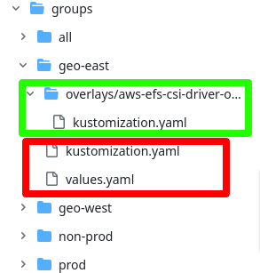

# GitOps standard folder layout for OpenShift multi-cluster day-two configurations

As the title suggest this standard layout is laser focused on addressing the infrastructure configurations (a.k.a. day-two) for a multi-cluster deployment of OpenShift.

## Repo Structure

These are the main folders:

### Components

This folder contains all of the root pieces of configurations. Each piece of configuration resides in its own subfolder. These components should never derive from anything (i.e. their resources and components lists in the `kustomization.yaml` file are empty).


### Groups

This folder contains common pieces of configurations that can be applied to a group of clusters. Groups can capture concepts like the purpose of the cluster (lab,non-prod, prod), the geography of the cluster (west, east, dc1, dc2), the security profile of the cluster (pci, non-pci, connected, disconnected) etc...

Groups are designed to be composable. So, based on the example groups from above, one should be able to express that a cluster belongs to the non-prod, east, pci groups.

Composition of groups is possible because groups are defined as kustomize [components](https://kubectl.docs.kubernetes.io/references/kustomize/kustomization/components/):

```yaml
apiVersion: kustomize.config.k8s.io/v1alpha1
kind: Component
```

The `all` group almost always exists and it captures the configuration that goes in every cluster.

Each group has it own folder. Within this folder, we can find two things: 

- A set of folders containing the group-specific overlays over some set of components.
- A root level kustomization that generates the ArgoCD applications for this group, using the [argocd-app-of-app](.helm/charts/argocd-app-of-app/) helm chart.



In this example, in green you can see the overlays over one component, while in red you can see the resources needed to generate the Argocd Applications for this group.

### Clusters

This folder contains the cluster-specific configurations. As for groups it is made of two parts:

- A set of folders containing the cluster-specific overlays over some set of components.
- A root level kustomization that generates the ArgoCD applications for this group, using the [argocd-app-of-app](.helm/charts/argocd-app-of-app/) helm chart. This kustomization must import the correct groups for this cluster, here is an example:

```yaml
apiVersion: kustomize.config.k8s.io/v1beta1
kind: Kustomization

components:
  - ../../groups/all
  - ../../groups/non-prod
  - ../../groups/geo-east
```

## Design Decisions

In no particular order, here are the design decisions that guides us to this current folder structure.

- Argocd Applications for the [App of App pattern](https://argo-cd.readthedocs.io/en/stable/operator-manual/cluster-bootstrapping/#app-of-apps-pattern) are generated via an Helm chart.
- Kustmomize is the primary templating mechanism, if one needs to use helm charts, that is still via the kustomize [HelmChartInflaterGenerator](https://kubectl.docs.kubernetes.io/references/kustomize/builtins/#_helmchartinflationgenerator_).


## How to use this repo

## Use cases

